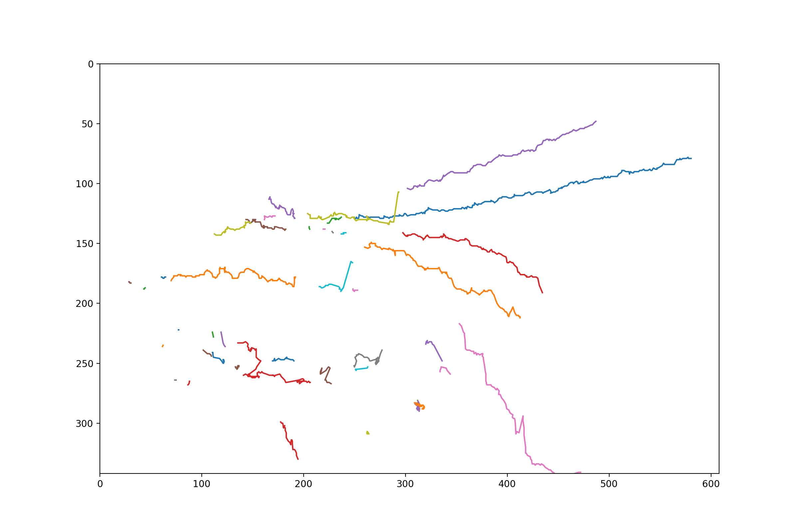
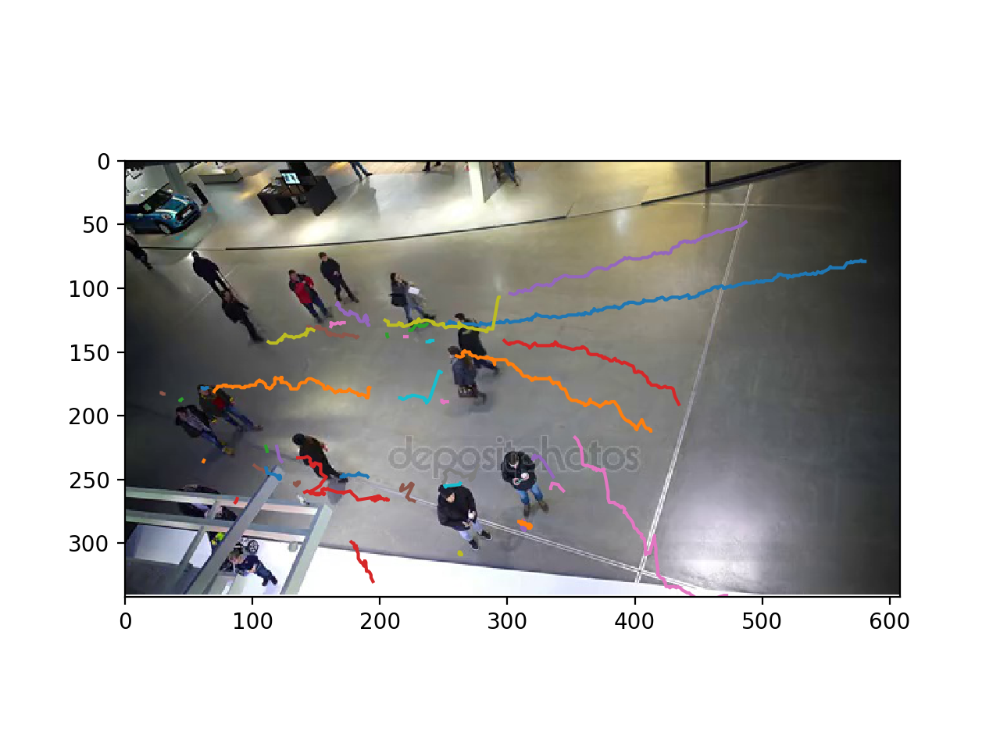

# people-pathing


## Description
`people-pathing` detects and tracks paths of multiple people in a video. `people-pathing` leverages [YOLO](https://arxiv.org/abs/1506.02640) for object detection (detecting people in each frame) and [SORT](https://arxiv.org/abs/1602.00763) for object tracking (tracking people between frames). `people-pathing` generates plots of paths traversed by people in the video.

## Usage
To use, ensure you have `PyTorch` and `OpenCV` installed in your environment.

Install the dependencies with the following command.

`pip install -r requirements.txt`

The YOLO model requires the `config` directory in your project directory have the following files, which can be found via [this link](https://pjreddie.com/darknet/yolo/).

```
config
+-- coco.data
+-- coco.names
+-- yolov3.cfg
+-- yolov3.weights
```

To run `people-pathing`, use the following command.

`python app.py video_file_path [overlay_image_path] [-n=num_frames] [-s, --silent] [-d, --detection]`

where

`video_file_path` is the path to the video file
`overlay_image_path` is the path to the image to overlay the measured paths on (optional, no overlay image by default)
`-n=num_frames` specifies the number of frames of the video to process (optional, all frames processed by default)
`-s, --silent` prevents `STDOUT` output from being displayed (optional, displays `STDOUT` output by default)
`-d, --detection` shows detection frame-by-frame while processing (optional, does not show frame-by-frame detection by default)

For example, the following command runs `people-pathing` on the video file `data/videos/people_walking_mall.mp4` on the first 200 frames of the video with no `STDOUT` output displayed, and frame-by-frame detection shown while processing.

`python app.py data/videos/people_walking_mall.mp4 -n=200 -s -d`

The following has the same result but overlays the plotted paths on top of the image `data/images/frame_1.jpg`

`python app.py data/videos/people_walking_mall.mp4 data/images/frame_1.jpg -n=200 -s -d`

## Examples

The following are plots generated by `people-pathing` with their corresponding commands.

Command: `python app.py data/videos/people_walking_mall.mp4 -n=300 -s -d`

<p float="left" align="center">
  
</p>

Command: `python app.py data/videos/people_walking_mall.mp4 data/images/frame_1.jpg -n=300 -s -d`

<p float="left" align="center">
  
</p>

## Resources

[Object detection and tracking in PyTorch](https://towardsdatascience.com/object-detection-and-tracking-in-pytorch-b3cf1a696a98)